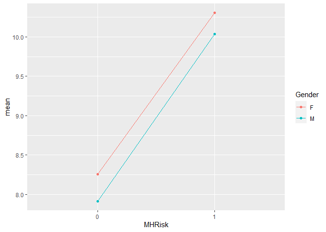

Insurance claim analysis
================
Mikel Tobar
11/24/2021

## Intro

In this analysis, I will go through a dataset that covers 90.000 worker
compensation insurance policies, analyzing each worker related
information.

The dataset can be found in the following link:
<https://www.kaggle.com/c/actuarial-loss-estimation/data>

``` r
#install.packages("nortest")
library("nortest")
#install.packages("caret")
library("caret")
#install.packages("rstatix")
library("rstatix")
#install.packages("agricolae")
library("agricolae")
#install.packages("dplyr")
library("dplyr")
#install.packages("tidyverse")
library("tidyverse")
#install.packages("lsr")
library("lsr")
```

## 1. File reading and data preparation

First, we’ll read the file and save it.

``` r
claim <-read.csv("train_1.csv")
```

We will check our columns in order to better understand the dataframe.

``` r
str(claim)
```

    ## 'data.frame':    54000 obs. of  15 variables:
    ##  $ ClaimNumber              : chr  "WC8285054" "WC6982224" "WC5481426" "WC9775968" ...
    ##  $ DateTimeOfAccident       : chr  "2002-04-09T07:00:00Z" "1999-01-07T11:00:00Z" "1996-03-25T00:00:00Z" "2005-06-22T13:00:00Z" ...
    ##  $ DateReported             : chr  "2002-07-05T00:00:00Z" "1999-01-20T00:00:00Z" "1996-04-14T00:00:00Z" "2005-07-22T00:00:00Z" ...
    ##  $ Age                      : int  48 43 30 41 36 50 39 56 49 30 ...
    ##  $ Gender                   : chr  "M" "F" "M" "M" ...
    ##  $ MaritalStatus            : chr  "M" "M" "U" "S" ...
    ##  $ DependentChildren        : int  0 0 0 0 0 0 0 0 0 0 ...
    ##  $ DependentsOther          : int  0 0 0 0 0 0 0 0 0 0 ...
    ##  $ WeeklyWages              : num  500 509 709 555 377 ...
    ##  $ PartTimeFullTime         : chr  "F" "F" "F" "F" ...
    ##  $ HoursWorkedPerWeek       : num  38 37.5 38 38 38 38 38 40 38 37 ...
    ##  $ DaysWorkedPerWeek        : int  5 5 5 5 5 5 5 5 5 5 ...
    ##  $ ClaimDescription         : chr  "LIFTING TYRE INJURY TO RIGHT ARM AND WRIST INJURY" "STEPPED AROUND CRATES AND TRUCK TRAY FRACTURE LEFT FOREARM" "CUT ON SHARP EDGE CUT LEFT THUMB" "DIGGING LOWER BACK LOWER BACK STRAIN" ...
    ##  $ InitialIncurredCalimsCost: int  1500 5500 1700 15000 2800 500 500 500 925 1500 ...
    ##  $ UltimateIncurredClaimCost: num  4748 6326 2294 17786 4014 ...

### 1.1 Preprocessing

We will set columns “DateTimeOfAccident” and “DateReported” as dates.

``` r
claim$DateTimeOfAccident<-as.Date(claim$DateTimeOfAccident)
claim$DateReported<-as.Date(claim$DateReported)
```

We will also create a new “Delay” column which counts the days from when
an accident happens to when a report is filed by the company.

``` r
claim$Delay <- claim$DateReported-claim$DateTimeOfAccident
```

### 1.2 Time Classifier

In order to divide the delay in various categories, we will create some
categories depending on the opening time of every single file. “Very
fast” means there has been an initial delay between 0 and 15 days,
“Fast” signals a 16-30 day delay, “Slow” tells when the time goes from
31 to 89 days, and “Very Slow” flags a 90 day+ delay.

``` r
claim$Delay <- gsub("days", "",claim$Delay)
claim$Delay <- as.numeric(claim$Delay)
claim$Classifier <- cut(claim$Delay, breaks = c(-100,15,30,89,10000), labels = c("Very Fast","Fast","Slow","Very Slow"))
```

### 1.3 Missing Values

Next, we will go through all categories in the “ClaimDescription”, “Sex”
and “MaritalStatus”. We will try to see how many descriptions there are
in this dataframe.

``` r
unique_descriptions <- unique(claim$ClaimDescription)
length(unique_descriptions)
```

    ## [1] 28114

``` r
table(claim$Gender)
```

    ## 
    ##     F     M     U 
    ## 12338 41660     2

``` r
table(claim$MaritalStatus)
```

    ## 
    ##           M     S     U 
    ##    29 22516 26161  5294

We can see how there are 5294 in the “U” (Unknown) category in the
“MaritalStatus” variable, 29 empty values, and none in the “Gender”
variable. We will flag them as missing values (NA), and they will be
deleted.

``` r
claim$MaritalStatus <- gsub("U",NA,claim$MaritalStatus)
claim$Gender <- gsub("U",NA,claim$Gender)
claim$MaritalStatus[nchar(claim$MaritalStatus)==0] <- NA
claim <- na.omit(claim)
sum(colSums(is.na(claim)))
```

    ## [1] 0

This way, we know that NA values are almost completely equal to the 5294
“Unknown” values.

### 1.4 Mental Health

We want to flag any mental health issues, and therefore we will check
through the “Description” column any signs of words potentially related
to these kinds of issues. A new “MHRisk” column will be created.

``` r
claim$MHRisk <- claim$ClaimDescription
claim$MHRisk <- gsub(pattern= ".*STRESS.*", 1, claim$MHRisk)
claim$MHRisk <- gsub(".*ANXIETY.*", 1, claim$MHRisk)
claim$MHRisk <- gsub(".*HARASSMENT.*", 1, claim$MHRisk)
claim$MHRisk <- gsub(".*DEPRESSION.*", 1, claim$MHRisk)
claim$MHRisk <- 
gsub("[[:blank:]]","",claim$MHRisk)
claim$MHRisk <- gsub("[a-zA-Z]+", 0, claim$MHRisk)
claim$MHRisk <- gsub("0=0", "0", claim$MHRisk)
claim$MHRisk <- gsub("0��0", "0", claim$MHRisk)

table(claim$MHRisk)
```

    ## 
    ##     0     1 
    ## 48459   216

### 1.5 Visual Analysis

Now, it is time to study some variables’ distribution, according to
“Gender”, “MaritalStatus”, “Classifier” and “MHRisk”. We think the best
analysis here would be a logarithmic one.

``` r
boxplot(claim$UltimateIncurredClaimCost~claim$Gender, main="Final Expendure and Gender", xlab="", ylab="Final Expendure (log)", log="y")
```

<!-- -->

``` r
boxplot(claim$UltimateIncurredClaimCost~claim$MaritalStatus, main="Final Expendure and Marital Status", xlab="", ylab="Final Expendure (log)", log="y")
```

<!-- -->

``` r
boxplot(claim$UltimateIncurredClaimCost~claim$Classifier, main="Final Expendure and Classifier", xlab="", ylab="Final Expendure (log)", log="y")
```

<!-- -->

``` r
boxplot(claim$UltimateIncurredClaimCost~claim$MHRisk, main="Final Expendure and MH Risk", xlab="", ylab="Final Expendure (log)", log="y")
```

<!-- -->

It is worth outlining there are many outliers in the superior zone,
which means there is a fair amount of higher values for each one of the
analyzed cathegories. We can assert the following statements:

-   Womens’ quantiles are slightly centered around higher values than
    mens’, including the median value.

-   Married people’s quantiles are a bit bigger than single people’s,
    including the median value.

-   When it comes to the processing timing, we can see how diagrams are
    more or less centered around the same values. However, slower
    records have a much shorter inferior distribution.

-   Finally, MHRisk analysis gives us a much longer boxplot when there
    is no danger for the mind’s wellfare, and a much shorter one when it
    exists.

### 1.6 Normality

We will now try to see if UltimateIncurredClaimCost has a normal
distribution or not. First we will undertake a rapid visual inspection.

``` r
hist(claim$UltimateIncurredClaimCost,main="Histogram")
```

<!-- -->

``` r
plot(density(claim$UltimateIncurredClaimCost),main="Density")
```

<!-- -->

``` r
qqnorm(claim$UltimateIncurredClaimCost, main="QQ Plot")
qqline(claim$UltimateIncurredClaimCost, main="QQ Plot")
```

<!-- -->

Secondly, we will check for normality with a Kolmogorov-Smirnov test
with Lilliefors correction. The null hypothesis will be against
normality, and the alternative for it.

``` r
library("nortest")
lillie.test(claim$UltimateIncurredClaimCost)
```

    ## 
    ##  Lilliefors (Kolmogorov-Smirnov) normality test
    ## 
    ## data:  claim$UltimateIncurredClaimCost
    ## D = 0.37798, p-value < 2.2e-16

This result hints a non-normal distribution. Neither histograms nor
p-test (lower than the 5% significance) show normality. The alternative
hypothesis is the accepted one.

In order to confirm logarithmic normality (something we have assumed
when created the boxplots), we will try the same method for the
logarithmic version of the distribution.

``` r
hist(log(claim$UltimateIncurredClaimCost),main="Histogram")
```

<!-- -->

``` r
plot(density(log(claim$UltimateIncurredClaimCost)),main="Density")
```

<!-- -->

``` r
qqnorm(log(claim$UltimateIncurredClaimCost), main="QQ Plot")
qqline(log(claim$UltimateIncurredClaimCost), main="QQ Plot")
```

<!-- -->

We will test with Lilliefors as we did before, with the same hypothesis.

``` r
lillie.test(log(claim$UltimateIncurredClaimCost))
```

    ## 
    ##  Lilliefors (Kolmogorov-Smirnov) normality test
    ## 
    ## data:  log(claim$UltimateIncurredClaimCost)
    ## D = 0.042294, p-value < 2.2e-16

We can see how, with a logarithmic scale, Final Cost proves to be
normal, as seen in the graphs and in the Lilliefors test. We accept the
null hypothesis.

## 2. Inferential Statistics

### 2.1 Confidence Interval of the Poblational Mean of the UltimateIncurredClaimCost Variable

We will check, with a 95% confidence rate, the
“UltimateIncurredClaimCost” variable confidence interval.

``` r
m <- mean(claim$UltimateIncurredClaimCost)
desv <- sd(claim$UltimateIncurredClaimCost)
n <- length(claim$UltimateIncurredClaimCost)
sig <- qt(0.05/2, df=(n-1), lower.tail=FALSE)

lim_inf <- m - sig*(desv/sqrt(n))
lim_sup <- m + sig*(desv/sqrt(n))

lim_inf
```

    ## [1] 10160.85

``` r
lim_sup
```

    ## [1] 10751.41

### 2.2 Hypotesis Contrast (Mean Difference)

We will pose the following question. Is it true that the payments women
get are, on average, worth 1000$ more than the ones men get?

### 2.2.1 Null Hypothesis and Alternative

Null hypothesis will be women not getting at least 1000$ more than men.
The alternative one will state they do.


The sample will be divided in 2 genders (M stands for Male and F for
Female).

``` r
comparison_men<-claim$UltimateIncurredClaimCost[claim$Gender=="M"]
comparison_women<-claim$UltimateIncurredClaimCost[claim$Gender=="F"]
```

### 2.2.2 Which Test to Apply

We will asume normality, as the CLT states for samples of more than 30
elements. We can compare both variances now, so that we can choose an
adequate test.

``` r
testVariances <- function(x,y){
  var.test(x,y)
}

testVariances(comparison_women,comparison_men)
```

    ## 
    ##  F test to compare two variances
    ## 
    ## data:  x and y
    ## F = 3.2487, num df = 11256, denom df = 37417, p-value < 2.2e-16
    ## alternative hypothesis: true ratio of variances is not equal to 1
    ## 95 percent confidence interval:
    ##  3.153694 3.347360
    ## sample estimates:
    ## ratio of variances 
    ##           3.248692

We get a p-value of less than 0.05, so we can discard variance equality.
The best fit would be a 2 sample test, with unknown and different for
each sample variance. It will also be unilateral, right-sided, and
mean-focused.

### 2.2.3 Calculations

``` r
function_test <- function(a, b){
  mean_a <- mean(a)
  mean_b <- mean(b)
  num_a <- length(a)
  num_b <- length(b)
  var_a <- sd(a)
  var_b <- sd(b)
  den_t <- sqrt((var_a^2/num_a)+(var_b^2/num_b))
  t <- (mean_a-mean_b-1000)/den_t
  gl <- (var_a^2/num_a+var_b^2/num_b)^2/(var_a^4/(num_a^2*(num_a-1))+var_b^4/(num_b^2*(num_b-1)))
  alfa <- (0.05)
  tcritico <- qt( alfa, gl, lower.tail=F )
  p<-pt( t, gl, lower.tail=F )
  return (data.frame("mean_Mujeres"=mean_a, "mean_Hombres"=mean_b, "n_Mujeres"=num_a, "n_Hombres"=num_b, "obs_value"=t, "critical"=tcritico, "pvalue"=p, "freedom_deg"=gl))
}

function_test(comparison_women,comparison_men)
```

    ##   mean_Mujeres mean_Hombres n_Mujeres n_Hombres obs_value critical       pvalue
    ## 1      12482.1     9846.631     11257     37418  3.418263 1.644967 0.0003160477
    ##   freedom_deg
    ## 1    13402.67

### 2.2.4 Test Interpretation

As we get a p-value which is higher than the significance, and being the
observed value higher than the critical one, the null hypothesis can be
rejected in favour of the alternative. It can be therefore stated that,
with a 95% degree of confidence, the mean payment for women is at least
1000$ higher than for men.

### 3.Linear Regression

We will create a Multiple Linear Regression model that has the following
explicative variables: Age, Gender, MaritalStatus, DependentChildren,
DepententsOther, WeeklyWages, PartTimeFullTime, HoursWorkedPerWeek,
DaysWorkedPerWeek, Classifier, MHRisk, InitialIncurredClaimCost. The
dependent variable will be UltimateIncurredClaimsCost in a logarithmic
scale. We will also work with InitialIncurredCalimCost in a logarithmic
scale.

The model is as follows.

``` r
claim_lm<-lm(log(UltimateIncurredClaimCost)~Age+Gender+MaritalStatus+DependentChildren+DependentsOther+WeeklyWages+PartTimeFullTime+HoursWorkedPerWeek+DaysWorkedPerWeek+Classifier+MHRisk+log(InitialIncurredCalimsCost), data=claim)

summary(claim_lm)
```

    ## 
    ## Call:
    ## lm(formula = log(UltimateIncurredClaimCost) ~ Age + Gender + 
    ##     MaritalStatus + DependentChildren + DependentsOther + WeeklyWages + 
    ##     PartTimeFullTime + HoursWorkedPerWeek + DaysWorkedPerWeek + 
    ##     Classifier + MHRisk + log(InitialIncurredCalimsCost), data = claim)
    ## 
    ## Residuals:
    ##     Min      1Q  Median      3Q     Max 
    ## -4.2949 -0.4735 -0.1408  0.3238  7.3715 
    ## 
    ## Coefficients:
    ##                                  Estimate Std. Error t value Pr(>|t|)    
    ## (Intercept)                     1.377e+00  4.636e-02  29.709  < 2e-16 ***
    ## Age                             4.467e-03  3.456e-04  12.925  < 2e-16 ***
    ## GenderM                        -1.189e-01  8.451e-03 -14.067  < 2e-16 ***
    ## MaritalStatusS                 -4.369e-02  8.371e-03  -5.220 1.80e-07 ***
    ## DependentChildren               4.044e-02  6.620e-03   6.108 1.02e-09 ***
    ## DependentsOther                 7.302e-02  3.097e-02   2.358  0.01839 *  
    ## WeeklyWages                     5.760e-04  1.526e-05  37.739  < 2e-16 ***
    ## PartTimeFullTimeP               4.136e-02  1.561e-02   2.650  0.00805 ** 
    ## HoursWorkedPerWeek              4.425e-04  2.962e-04   1.494  0.13513    
    ## DaysWorkedPerWeek              -4.661e-02  8.342e-03  -5.588 2.31e-08 ***
    ## ClassifierFast                  2.556e-02  8.578e-03   2.979  0.00289 ** 
    ## ClassifierSlow                  1.551e-02  8.983e-03   1.727  0.08418 .  
    ## ClassifierVery Slow             9.336e-03  1.338e-02   0.698  0.48534    
    ## MHRisk1                         2.672e-01  5.158e-02   5.181 2.21e-07 ***
    ## log(InitialIncurredCalimsCost)  8.416e-01  2.440e-03 344.851  < 2e-16 ***
    ## ---
    ## Signif. codes:  0 '***' 0.001 '**' 0.01 '*' 0.05 '.' 0.1 ' ' 1
    ## 
    ## Residual standard error: 0.7527 on 48660 degrees of freedom
    ## Multiple R-squared:  0.7552, Adjusted R-squared:  0.7551 
    ## F-statistic: 1.072e+04 on 14 and 48660 DF,  p-value: < 2.2e-16

### 3.1 Model Interpretation

In order to know the adjustment quality, we can check the Adjusted
R-Squared value. A 0.7551 means the chosen variables explain 75.5% of
the UltimateIncurredClaimCost variable in a logarithmic scale. P-value
also points out a good fit, being smaller than the 5% significancy.

We can study each variable’s p-value in order to see their impact on the
model. DependentOthers and DaysWorkedPerWeek have p-values of less than
5% in every level, so they aren’t considered relevant for this
adjustment.

### 3.2 Residuals Analysis

We can analyze residuals if we want to go further in the adjustment
quality evaluation.

``` r
residuals <- rstandard(claim_lm)
summary(residuals)
```

    ##      Min.   1st Qu.    Median      Mean   3rd Qu.      Max. 
    ## -5.767687 -0.629264 -0.187140 -0.000002  0.430262  9.799150

``` r
adjustment <- fitted(claim_lm)
plot(adjustment, residuals)
```

<!-- -->

We see no suspicious patterns in the results, so we can validate our
model.

### 3.3 Prediction

We will now try to predict the final cost for someone who falls under
certain cathegories.

``` r
PersonalData = data.frame(Age=24, Gender="F", MaritalStatus="S", DependentChildren=1, DependentsOther=0, WeeklyWages=500, PartTimeFullTime="F", HoursWorkedPerWeek=40, DaysWorkedPerWeek=5, Classifier="Slow", MHRisk="1", InitialIncurredCalimsCost=10000)

prediction_logarithm <- predict(claim_lm,PersonalData)
prediction_mean <- exp(prediction_logarithm+var(claim_lm$residuals)/2)
prediction_median <- exp(prediction_logarithm)

#Logarithm of value
prediction_logarithm
```

    ##        1 
    ## 9.587663

``` r
#Expected value
prediction_mean
```

    ##        1 
    ## 19357.65

``` r
#Median value
prediction_median
```

    ##        1 
    ## 14583.74

It’s worth saying that, not being the cost variables in a normal scale,
we have been forced to operate them in logarithmical scales. However, in
order to get a more balanced prediction, we have gotten the mean and
median values. They are very far away due to the lack of normality, so
we have consider that before getting any conclusion.

## 4. Logistical Regression

### 4.1 Predictive model

We will create a new variable called Deficit, and try to predict if it
exists or not for every value.

``` r
claim$Deficit <- claim$UltimateIncurredClaimCost

claim$Deficit <- as.numeric(claim$Deficit)
claim$InitialIncurredCalimsCost <- as.numeric(claim$InitialIncurredCalimsCost)

for (i in 1:length(claim$Deficit))
{
  if(claim[i,15] > claim[i,14]) {
    claim[i,19] = 1
  } else {
      claim[i,19] = 0
    }
}

claim_glm<-glm(Deficit~Age+Gender+MaritalStatus+DependentChildren+DependentsOther+WeeklyWages+PartTimeFullTime+HoursWorkedPerWeek+Classifier+MHRisk+log(InitialIncurredCalimsCost), family=binomial, data=claim)
summary(claim_glm)
```

    ## 
    ## Call:
    ## glm(formula = Deficit ~ Age + Gender + MaritalStatus + DependentChildren + 
    ##     DependentsOther + WeeklyWages + PartTimeFullTime + HoursWorkedPerWeek + 
    ##     Classifier + MHRisk + log(InitialIncurredCalimsCost), family = binomial, 
    ##     data = claim)
    ## 
    ## Deviance Residuals: 
    ##     Min       1Q   Median       3Q      Max  
    ## -5.0753  -1.1377   0.7026   1.0489   2.2255  
    ## 
    ## Coefficients:
    ##                                  Estimate Std. Error z value Pr(>|z|)    
    ## (Intercept)                     2.581e+00  7.464e-02  34.576  < 2e-16 ***
    ## Age                             1.095e-02  9.751e-04  11.234  < 2e-16 ***
    ## GenderM                        -3.417e-01  2.379e-02 -14.362  < 2e-16 ***
    ## MaritalStatusS                 -9.248e-02  2.346e-02  -3.942 8.07e-05 ***
    ## DependentChildren               1.381e-01  1.951e-02   7.080 1.44e-12 ***
    ## DependentsOther                 2.174e-01  9.246e-02   2.351  0.01870 *  
    ## WeeklyWages                     1.983e-03  5.161e-05  38.420  < 2e-16 ***
    ## PartTimeFullTimeP               2.452e-01  3.684e-02   6.656 2.81e-11 ***
    ## HoursWorkedPerWeek             -9.574e-04  8.298e-04  -1.154  0.24858    
    ## ClassifierFast                  8.956e-02  2.400e-02   3.731  0.00019 ***
    ## ClassifierSlow                  3.623e-02  2.514e-02   1.441  0.14946    
    ## ClassifierVery Slow            -3.016e-02  3.749e-02  -0.804  0.42122    
    ## MHRisk1                         2.941e-01  1.451e-01   2.027  0.04270 *  
    ## log(InitialIncurredCalimsCost) -4.288e-01  7.296e-03 -58.777  < 2e-16 ***
    ## ---
    ## Signif. codes:  0 '***' 0.001 '**' 0.01 '*' 0.05 '.' 0.1 ' ' 1
    ## 
    ## (Dispersion parameter for binomial family taken to be 1)
    ## 
    ##     Null deviance: 67238  on 48674  degrees of freedom
    ## Residual deviance: 62486  on 48661  degrees of freedom
    ## AIC: 62514
    ## 
    ## Number of Fisher Scoring iterations: 4

### 4.2 Interpretation

The model gives us many p-values of less than 5% , what means most
variables are significative. However, this is not true for all of them:
“DependentsOther”, “HoursWorkedPerWeek” as well as some cathegories of
the classifier.

### 4.3 Confusion Matrix

We will use this method to see how good is the model.

``` r
library("caret")
prediction<- ifelse(predict(claim_glm, type="response") > 0.5, "1", "0")
real <- claim$Deficit
confusionMatrix(table( prediction, real),positive="1")
```

    ## Confusion Matrix and Statistics
    ## 
    ##           real
    ## prediction     0     1
    ##          0 11478  7402
    ##          1 11151 18644
    ##                                           
    ##                Accuracy : 0.6188          
    ##                  95% CI : (0.6145, 0.6232)
    ##     No Information Rate : 0.5351          
    ##     P-Value [Acc > NIR] : < 2.2e-16       
    ##                                           
    ##                   Kappa : 0.2255          
    ##                                           
    ##  Mcnemar's Test P-Value : < 2.2e-16       
    ##                                           
    ##             Sensitivity : 0.7158          
    ##             Specificity : 0.5072          
    ##          Pos Pred Value : 0.6257          
    ##          Neg Pred Value : 0.6079          
    ##              Prevalence : 0.5351          
    ##          Detection Rate : 0.3830          
    ##    Detection Prevalence : 0.6121          
    ##       Balanced Accuracy : 0.6115          
    ##                                           
    ##        'Positive' Class : 1               
    ## 

Our confusion matrix gives us a good classification of 20.368 deficits,
not being able to detect 5.678. We detect 9.984 absences of deficit, and
we don’t get 12.645 of them (false negatives).

Our accuracy is of 62.36%, a sensitivity del 78.2% and a specificity de
44.12%.

This we get about 6 cases correctly of every 10. Sensitivity means a
good behaviour for positive values (about 8 in 10), but we don’t have
such good results for negatives (4 in 10).

### 4.4 Prediction

We will try to predict the possibility of having a deficit with some
random personal data.

``` r
PersonalData_glm = data.frame(Age=20, Gender="M", MaritalStatus="S", DependentChildren=0, DependentsOther=0, WeeklyWages=300, PartTimeFullTime="P", HoursWorkedPerWeek=30, DaysWorkedPerWeek=5, Classifier="Very Slow", MHRisk="0", InitialIncurredCalimsCost=10000)
predict(claim_glm, PersonalData_glm,type="response")
```

    ##         1 
    ## 0.3094398

With this data we would have a 30,94% probability.

## 5 One factor ANOVA

Next, we will do a one-factor ANOVA, studying variations in
UltimateIncurredClaimCost, depending on the filing classifier.

### 5.1 Null and Alternative Hypothesis

We will layout Null and Alternative Hypothesis as follows.


For each μ we would have a different classifier level (Very Fast, Fast,
Slow, Very Slow)

### 5.2 Model

The model will be as follows.

``` r
anova_classification <- aov(log(UltimateIncurredClaimCost) ~ Classifier, claim)
anova_1 <- anova(anova_classification)
anova_1
```

    ## Analysis of Variance Table
    ## 
    ## Response: log(UltimateIncurredClaimCost)
    ##               Df Sum Sq Mean Sq F value    Pr(>F)    
    ## Classifier     3    199  66.265  28.689 < 2.2e-16 ***
    ## Residuals  48671 112419   2.310                      
    ## ---
    ## Signif. codes:  0 '***' 0.001 '**' 0.01 '*' 0.05 '.' 0.1 ' ' 1

Checking its p-value, which is smaller than 0.05, we can accept the
alternative hypothesis, which states a significative factor difference.

### 5.3 Factor Levels Effect

We will use the eta-squared metric in order to calculate variability
explained by the Classification variable.

``` r
library("rstatix")
eta_squared(anova_classification)
```

    ##  Classifier 
    ## 0.001765225

According to the Richardson and Cohen classification, the effect of the
factor levels is small from 0.0099, medium from 0.0588, and big from
0.1379 (numbers are eta scores).

Therefore, we can assert there isn’t a big effect of the factor levels,
as we are lying under the lower limit. As a result, this difference
between levels won’t be significative.

### 5.4 Tukey Test

We will apply the Tukey test in order to check each level.

``` r
library("agricolae")
HSD.test(anova_classification,"Classifier",console=T)
```

    ## 
    ## Study: anova_classification ~ "Classifier"
    ## 
    ## HSD Test for log(UltimateIncurredClaimCost) 
    ## 
    ## Mean Square Error:  2.309764 
    ## 
    ## Classifier,  means
    ## 
    ##           log.UltimateIncurredClaimCost.      std     r      Min      Max
    ## Fast                            8.074513 1.506686 16237 4.813524 15.20857
    ## Slow                            8.016321 1.535227 13589 4.900228 13.67138
    ## Very Fast                       7.915437 1.487572 14789 4.803093 13.62157
    ## Very Slow                       8.004937 1.632039  4060 5.030458 13.23285
    ## 
    ## Alpha: 0.05 ; DF Error: 48671 
    ## Critical Value of Studentized Range: 3.63316 
    ## 
    ## Groups according to probability of means differences and alpha level( 0.05 )
    ## 
    ## Treatments with the same letter are not significantly different.
    ## 
    ##           log(UltimateIncurredClaimCost) groups
    ## Fast                            8.074513      a
    ## Slow                            8.016321      b
    ## Very Slow                       8.004937      b
    ## Very Fast                       7.915437      c

We can see how there are some differences between groups, with costs
going from 7.91 (logarithmic) to 8.07.

### 5.5 Model Fitness

We will now evaluate the fitness of the model, as follows.

### 5.5.1 Residuals Normality

We will now check for normality in the residuals. We can study the
model’s residuals in order to operate.

``` r
residuals_anova<-residuals(anova_classification)

qqnorm(residuals_anova)
qqline(residuals_anova)
```

<!-- -->

We can confirm normality in the residuals as the graphs show us.

### 5.5.2 Residuals homoscedasticity

We will now evaluate the homoscedasticity of the residuals, looking at
the “Residuals vs Fitted” graph.

``` r
plot(anova_classification,1)
```

<!-- -->

We can spot different groups, and will wait to confirm the
homoscedasticity in the next point. For now, we can say there is a good
distribution of the residuals by levels, not seeing many outliers, but
we will have to confirm this.

### 5.5.3 Normality, Homoscedasticity contrast

We can look for normality with the Lilliefors test, with a 95%
confidence level. As in the cases we evaluated before, we will see if
the null hypothesis proves right (normal distribution) or if, on the
contrary, the alternative (not normal distribution) is the privileged
one.

``` r
lillie.test(residuals(anova_classification))
```

    ## 
    ##  Lilliefors (Kolmogorov-Smirnov) normality test
    ## 
    ## data:  residuals(anova_classification)
    ## D = 0.04176, p-value < 2.2e-16

We get a p-value much higher than the 5% significance, whici confirms
the null hypothesis (normality).

We will corroborate this through the Bartlett test. Here, null
hypothesis says that variances are similar, and the alternative, that
they aren’t.

``` r
bartlett.test(log(UltimateIncurredClaimCost) ~ Classifier, data= claim)
```

    ## 
    ##  Bartlett test of homogeneity of variances
    ## 
    ## data:  log(UltimateIncurredClaimCost) by Classifier
    ## Bartlett's K-squared = 61.85, df = 3, p-value = 2.366e-13

As the p-value confirms, null hypothesis is rejected, and equal
variances can be assumed.

## 6. Multifactorial ANOVA

We will evaluate the effect on the “UltimateIncurredClaimCost” in a
logarithmic scale, comparing “Gender” and “MHRisk”

### 6.1 Main effects analysis and possible interactions

We can plot the “UltimateIncurredClaimCost” variable in a logarithmic
scale, compared with “Gender” and “MHRisk”, watching their interactions.

In the first place, we can group the data by Gender and MHRisk,
calculating the possible cases for each combination. We will show the
mean for every group.

``` r
library("dplyr")

group_by(claim, Gender, MHRisk) -> group
summary <- summarise(group,
    total = length(log(UltimateIncurredClaimCost)),
    mean = mean(log(UltimateIncurredClaimCost)),
    sd = sd(log(UltimateIncurredClaimCost))
  )
```

    ## `summarise()` has grouped output by 'Gender'. You can override using the `.groups` argument.

``` r
summary
```

    ## # A tibble: 4 x 5
    ## # Groups:   Gender [2]
    ##   Gender MHRisk total  mean    sd
    ##   <chr>  <chr>  <int> <dbl> <dbl>
    ## 1 F      0      11173  8.26  1.45
    ## 2 F      1         84 10.3   1.01
    ## 3 M      0      37286  7.92  1.53
    ## 4 M      1        132 10.0   1.18

We will now plot the preceding results.

``` r
library("ggplot2")
ggplot(summary, aes(x=MHRisk, y=mean, group=Gender, color=Gender)) +
geom_point() + geom_line() 
```

<!-- -->

It could be said there is no interaction in sight, according to the
paralelism between segments. This will be confirmed in the incoming
points.

### 6.2 ANOVA Model

We will create an ANOVA Model that gives us the different effects.

``` r
anova_gender_MHRisk<-aov(log(UltimateIncurredClaimCost) ~ Gender*MHRisk,claim)
anova(anova_gender_MHRisk)
```

    ## Analysis of Variance Table
    ## 
    ## Response: log(UltimateIncurredClaimCost)
    ##                  Df Sum Sq Mean Sq  F value Pr(>F)    
    ## Gender            1   1062 1062.19 467.3731 <2e-16 ***
    ## MHRisk            1    941  941.26 414.1618 <2e-16 ***
    ## Gender:MHRisk     1      0    0.30   0.1315 0.7168    
    ## Residuals     48671 110614    2.27                    
    ## ---
    ## Signif. codes:  0 '***' 0.001 '**' 0.01 '*' 0.05 '.' 0.1 ' ' 1

Main factors are significative, however, the interaction proves not
relevant due a p-value higher than the significance (0.5343).

Therefore, as there is no interaction, we can try a summation model.

``` r
anova_gender_MHRisk_sum<-aov(log(UltimateIncurredClaimCost) ~ Gender+MHRisk,claim)
anova(anova_gender_MHRisk_sum)
```

    ## Analysis of Variance Table
    ## 
    ## Response: log(UltimateIncurredClaimCost)
    ##              Df Sum Sq Mean Sq F value    Pr(>F)    
    ## Gender        1   1062 1062.19  467.38 < 2.2e-16 ***
    ## MHRisk        1    941  941.26  414.17 < 2.2e-16 ***
    ## Residuals 48672 110614    2.27                      
    ## ---
    ## Signif. codes:  0 '***' 0.001 '**' 0.01 '*' 0.05 '.' 0.1 ' ' 1

We can see how the summation model is similar to the one we tried just
before, so we can take any of them.

Afterwards, we can measure using Bonferroni in order to confirm the
anova results. This is a quite conservative test.

``` r
LSD.test(anova_gender_MHRisk,"MHRisk",group=F,p.adj="bonferroni",console=T)
```

    ## 
    ## Study: anova_gender_MHRisk ~ "MHRisk"
    ## 
    ## LSD t Test for log(UltimateIncurredClaimCost) 
    ## P value adjustment method: bonferroni 
    ## 
    ## Mean Square Error:  2.272679 
    ## 
    ## MHRisk,  means and individual ( 95 %) CI
    ## 
    ##   log.UltimateIncurredClaimCost.      std     r      LCL       UCL      Min
    ## 0                       7.994604 1.515911 48459 7.981181  8.008027 4.803093
    ## 1                      10.141571 1.121216   216 9.940523 10.342620 7.157387
    ##        Max
    ## 0 15.20857
    ## 1 13.15470
    ## 
    ## Alpha: 0.05 ; DF Error: 48671
    ## Critical Value of t: 1.960013 
    ## 
    ## Comparison between treatments means
    ## 
    ##       difference pvalue signif.       LCL       UCL
    ## 0 - 1  -2.146967      0     *** -2.348464 -1.945471

``` r
LSD.test(anova_gender_MHRisk,"Gender",group=F,p.adj="bonferroni",console=T)
```

    ## 
    ## Study: anova_gender_MHRisk ~ "Gender"
    ## 
    ## LSD t Test for log(UltimateIncurredClaimCost) 
    ## P value adjustment method: bonferroni 
    ## 
    ## Mean Square Error:  2.272679 
    ## 
    ## Gender,  means and individual ( 95 %) CI
    ## 
    ##   log.UltimateIncurredClaimCost.      std     r      LCL      UCL      Min
    ## F                       8.273456 1.457539 11257 8.245607 8.301306 5.073079
    ## M                       7.923106 1.530465 37418 7.907831 7.938382 4.803093
    ##        Max
    ## F 15.20857
    ## M 13.67138
    ## 
    ## Alpha: 0.05 ; DF Error: 48671
    ## Critical Value of t: 1.960013 
    ## 
    ## Comparison between treatments means
    ## 
    ##       difference pvalue signif.       LCL       UCL
    ## F - M  0.3503501      0     *** 0.3185865 0.3821137

The Bonferroni test confirm the significative differences between
levels, as it shows a p-value lower than the significancy (5%).

We will end this analysis with a visual analysis of normalcy and
homoscedasticity.

``` r
plot(anova_gender_MHRisk,1)
```

<!-- -->

``` r
plot(anova_gender_MHRisk,2)
```

<!-- -->

Our plots tend to indicate the normalcy of the sample, but we can’t
overlook the heteroscedasticity of the data, as we get some outliers in
some columns.

### 6.3 Results interpretation

We can assert that this is a model with significative factors, without
interaction, with a significative difference between levels.

## 7. Conclusions

-   The UltimateIncurredClaimCost variable doesn’t follow a normal
    distribution, but when we apply a logarithmic scale it does.

-   The mean payment for women is more than 1000$ higher than men’s.

-   In the linear regression model, the majority of the chosen variables
    are significative. We can say the adjustment is fairly good, as the
    residuals indicate. When predicting using this model, the median
    value is far from the mean one, so it’s difficult to give an exact
    predictive result. Finally, the R-Squared value is quite big.

-   The logistic regression model gives intermediate precision,
    sensitivity and specificity, but good accuracy. Most variables are
    significative.

-   As the ANOVA says, the classifier is significative and directly
    affects the UltimateIncurredClaimCost variable, but its influence is
    not big in the final value. We see normalcy and heteroscedasticity.

-   Finally, the multi-factor ANOVA (MHRisk and Sex) points out to
    significative factors, but there is no interaction. We see
    differences in all levels.

## 8. Bibliography

-   <http://www.sthda.com/english/wiki/two-way-anova-test-in-r>

-   <https://stats.stackexchange.com/questions/53421/partial-eta-squared>

-   <https://www.statology.org/effect-size/>
